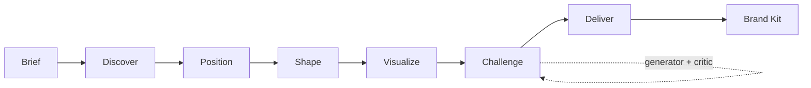

<div align="center">

# Brandloom

**From rough idea to launch-ready brand, through a staged, self-critiquing AI pipeline.**

[](https://brandloom-ai-client.onrender.com)


</div>

---

## Table of Contents

- [The Problem](#the-problem)
- [The Solution](#the-solution)
- [The 6-Stage Pipeline](#the-6-stage-pipeline)
- [Key Engineering Highlights](#key-engineering-highlights)
- [Architecture](#architecture)
- [Tech Stack](#tech-stack)
- [Getting Started](#getting-started)
- [Environment Variables](#environment-variables)
- [API Reference](#api-reference)
- [Deployment](#deployment)
- [Project Structure](#project-structure)
- [Team](#team)
- [License](#license)

---

## The Problem

Founders and creators start with one rough sentence, and that is not a brand. Hiring a branding agency is unaffordable for most early-stage teams, while basic AI tools return generic, disconnected outputs: a logo here, a tagline there, with no shared strategy behind them.

## The Solution

Brandloom is a collaborative brand engine that interviews your idea, positions it, shapes its personality, visualizes it, **challenges its own output for clichés**, and delivers a consistency-checked brand kit. Each stage builds on the structured output of the previous one, so nothing restarts from zero.

> Built for the **Inkloom x We Code Coders Hackathon**.

## The 6-Stage Pipeline

| # | Stage | What it produces |
|---|-------|------------------|
| 1 | **Discover** (`understand`) | Problem, audience, constraints, open questions |
| 2 | **Position** | Category, value proposition, differentiator |
| 3 | **Shape** | Personality traits, traits to avoid, naming directions, voice, tagline |
| 4 | **Visualize** | Typography, color mood, imagery style, concepts to avoid |
| 5 | **Challenge** | Clichés and weak assumptions flagged, with stronger alternatives |
| 6 | **Deliver** | Final brand name, summary, launch copy, exportable brand kit |



Each stage's validated JSON output is passed forward as context. Every controller rejects a request that is missing its required prior stage before any AI call is made.

## Key Engineering Highlights

- **Staged reasoning, not one giant prompt.** Each stage has a narrow, focused prompt and only receives the context it needs, which keeps outputs consistent and debuggable.
- **Schema-validated AI output.** Every stage response is checked against a strict schema (`server/src/ai/schemas`). If the model returns malformed or incomplete JSON, the pipeline re-prompts once with the exact validation error appended, so it self-corrects without human intervention.
- **Generator and critic debate loop.** The Challenge stage runs two independent AI passes: a generator over-reports possible weaknesses, then a critic pressure-tests each finding against the full context, drops what does not hold up, and produces the final result. This avoids a single model grading its own work.
- **Provider-agnostic AI client.** Works with any OpenAI-compatible chat-completions endpoint (currently Groq, `openai/gpt-oss-120b`), configured entirely through environment variables.
- **Rate-limit-aware retries.** On a `429`, the backend reads the provider's own "try again in Xs" hint and waits that long before retrying, instead of retrying blindly into the same limit.
- **Honest by design.** Prompts distinguish user-provided facts from generated proposals, avoid inventing evidence, and surface uncertainty in the output (`openGaps`).
- **Secure auth.** Email/password with hashed credentials, Google and GitHub OAuth with automatic account linking by email (no duplicate accounts), JWT sessions, and 6-digit password-reset codes with expiry.
- **Hardened API.** Helmet, CORS allow-listing, request size limits, and per-IP rate limiting on both auth and AI routes.

## Architecture

```
┌────────────────────┐        ┌──────────────────────────────┐       ┌────────────────┐
│  React + Vite SPA  │  HTTPS │  Express API                 │       │  AI Provider   │
│  (Render Static)   │ ─────► │  (Render Web Service)        │ ────► │  (Groq, OpenAI │
│                    │        │                              │       │   compatible)  │
│  Staged workflow   │        │  auth · stages · brand       │       └────────────────┘
│  UI, auth, kits    │        │  runStage: prompt → call →   │
└────────────────────┘        │  extract JSON → validate →   │       ┌────────────────┐
                              │  retry                       │ ────► │  MongoDB Atlas │
                              └──────────────────────────────┘       └────────────────┘
```

More detail lives in [`docs/architecture.md`](docs/architecture.md) and [`docs/prompt-design.md`](docs/prompt-design.md).

## Tech Stack

| Layer | Technology |
|-------|------------|
| Frontend | React 18, Vite, React Router, Tailwind CSS, Axios |
| Backend | Node.js (18+), Express |
| Database | MongoDB Atlas, Mongoose |
| AI | Groq via OpenAI-compatible API (`openai/gpt-oss-120b`) |
| Auth | JWT, Passport (Google OAuth 2.0, GitHub OAuth), bcrypt |
| Email | Brevo transactional email API |
| Hosting | Render (Web Service + Static Site) |

## Getting Started

### Prerequisites

- Node.js 18 or newer
- A MongoDB instance (local or [MongoDB Atlas](https://www.mongodb.com/atlas))
- An API key for an OpenAI-compatible provider such as [Groq](https://console.groq.com)

### Installation

```bash
# 1. Clone the repository
git clone https://github.com/Fullstackfox-byte/Brandloom-AI.git
cd Brandloom-AI

# 2. Install dependencies (root, server, client)
npm install
npm install --prefix server
npm install --prefix client

# 3. Configure environment variables
cp server/.env.example server/.env
# then edit server/.env (see the table below)
# create client/.env with VITE_API_URL=http://localhost:3001

# 4. Start both apps together
npm run dev
```

| Service | URL |
|---------|-----|
| Frontend | http://localhost:5173 |
| API | http://localhost:3001 |
| Health check | http://localhost:3001/api/health |

Run them individually with `npm run dev:server` and `npm run dev:client`.

> **Tip:** if `BREVO_API_KEY` is empty in development, the 6-digit password-reset code is printed in the server console instead of being emailed.

## Environment Variables

### Server (`server/.env`)

| Variable | Required | Description |
|----------|:--------:|-------------|
| `PORT` | No | API port (default `3001`) |
| `CLIENT_ORIGIN` | Yes | Frontend URL, used for CORS and OAuth redirects |
| `MONGO_URI` | Yes | MongoDB connection string |
| `JWT_SECRET` | Yes | Secret used to sign JWTs |
| `JWT_EXPIRES_IN` | No | Token lifetime (default `7d`) |
| `AI_API_KEY` | Yes | API key for the AI provider |
| `AI_BASE_URL` | Yes | OpenAI-compatible chat-completions endpoint |
| `AI_MODEL` | Yes | Model name, e.g. `openai/gpt-oss-120b` |
| `BREVO_API_KEY` | For email | Brevo API key for password-reset emails |
| `EMAIL_FROM` | For email | Verified sender address in Brevo |
| `GOOGLE_CLIENT_ID` / `GOOGLE_CLIENT_SECRET` / `GOOGLE_CALLBACK_URL` | For Google login | Google OAuth credentials |
| `GITHUB_CLIENT_ID` / `GITHUB_CLIENT_SECRET` / `GITHUB_CALLBACK_URL` | For GitHub login | GitHub OAuth credentials |

### Client (`client/.env`)

| Variable | Description |
|----------|-------------|
| `VITE_API_URL` | Backend base URL |
| `VITE_SOCKET_URL` | Backend base URL for realtime features |
| `VITE_GOOGLE_CLIENT_ID` | Google OAuth client ID |
| `VITE_GITHUB_CLIENT_ID` | GitHub OAuth client ID |

> Never commit `.env` files. They are already covered by `.gitignore`.

## API Reference

### Health

| Method | Endpoint | Description |
|--------|----------|-------------|
| `GET` | `/api/health` | Service health check |

### AI Stages

| Method | Endpoint | Description |
|--------|----------|-------------|
| `POST` | `/api/stages/:stageName` | Run a stage. `stageName` is one of `understand`, `position`, `shape`, `visualize`, `challenge`, `deliver` |
| `POST` | `/api/stages/:stageName/session/:id` | Run a stage and persist the result on a brand session |

Example:

```bash
curl -X POST http://localhost:3001/api/stages/understand \
  -H "Content-Type: application/json" \
  -d '{"brief": "A subscription box for rescued-pet owners"}'
```

### Brand Sessions

| Method | Endpoint | Description |
|--------|----------|-------------|
| `POST` | `/api/brand` | Create a brand session from a brief |
| `GET` | `/api/brand/:id` | Fetch a session and its stage outputs |
| `PUT` | `/api/brand/:id` | Update a session |

### Authentication

| Method | Endpoint | Description |
|--------|----------|-------------|
| `POST` | `/api/auth/signup` | Register with email and password |
| `POST` | `/api/auth/login` | Log in |
| `POST` | `/api/auth/forgot-password` | Send a 6-digit reset code |
| `POST` | `/api/auth/verify-reset-code` | Verify the reset code |
| `POST` | `/api/auth/reset-password` | Set a new password |
| `GET` | `/api/auth/google` | Start Google OAuth |
| `GET` | `/api/auth/github` | Start GitHub OAuth |

## Deployment

Brandloom is deployed on [Render](https://render.com).

**Backend (Web Service)**

| Setting | Value |
|---------|-------|
| Root Directory | `server` |
| Build Command | `npm install` |
| Start Command | `npm start` |

**Frontend (Static Site)**

| Setting | Value |
|---------|-------|
| Root Directory | `client` |
| Build Command | `npm install && npm run build` |
| Publish Directory | `dist` |
| Rewrite Rule | `/*` → `/index.html` (required for React Router) |

**Notes**

- Add all server and client environment variables in the Render dashboard.
- Set the OAuth callback URLs in the Google Cloud Console and GitHub developer settings to your deployed backend URL (`https://<backend>/api/auth/google/callback` and `/github/callback`).
- Render's free tier blocks outbound SMTP ports (25, 465, 587), which is why password-reset emails are sent through the Brevo HTTP API instead of SMTP.
- Free-tier services sleep after inactivity, so the first request can take up to ~50 seconds.

## Project Structure

```
Brandloom-AI/
├── client/                     # React + Vite frontend
│   └── src/
│       ├── api/                # API client (brandApi.js)
│       ├── components/         # UI, stage panels, auth layout
│       ├── context/            # Brand and theme state
│       ├── lib/                # Stage definitions, templates, stores
│       └── pages/              # Landing, Login, SignUp, Workflow, Projects...
├── server/                     # Express backend
│   └── src/
│       ├── ai/
│       │   ├── prompts/        # One prompt template per stage
│       │   ├── schemas/        # JSON schema per stage + validator
│       │   ├── client.js       # Provider-agnostic AI client
│       │   ├── runStage.js     # Prompt → call → parse → validate → retry
│       │   └── systemPrompt.js
│       ├── config/             # MongoDB and Passport setup
│       ├── controllers/        # Stage and auth controllers
│       ├── middleware/         # Error handling
│       ├── models/             # User, BrandSession
│       ├── routes/             # auth, brand, stages
│       └── utils/              # Email sending
└── docs/                       # Architecture and prompt design notes
```


## License

Distributed under the MIT License. See [`LICENSE`](LICENSE) for details.
